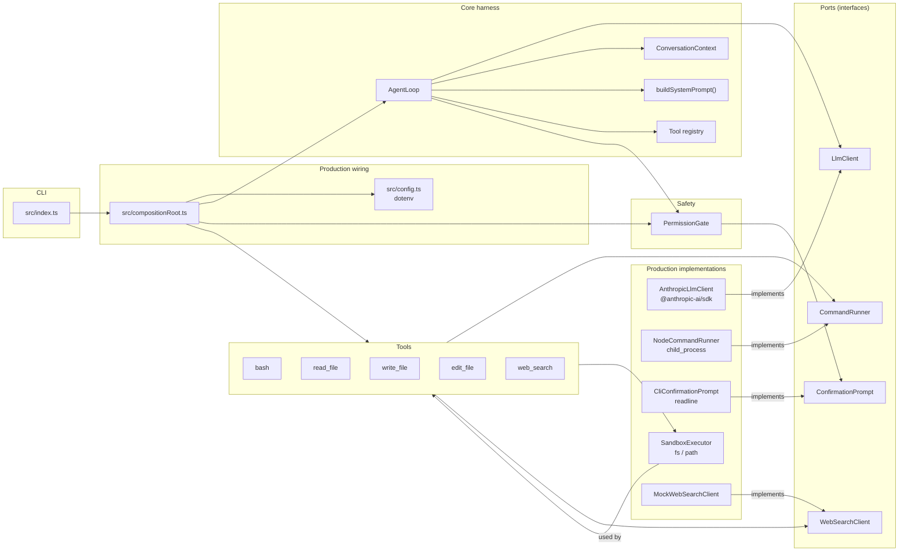

# Agent Harness

A scratch-built agent harness in TypeScript + Node.js that calls the Anthropic API (`@anthropic-ai/sdk`) directly. It does not use LangChain, Vercel AI SDK, Mastra, or any other agent framework.

## Setup

1. Copy `.env.example` to `.env` and fill in `ANTHROPIC_API_KEY`.
2. Run `npm install`.
3. Run `npm run start` and type a task at the `>` prompt.
4. (Optional) Set `WORKING_DIR` in `.env` to the directory the agent should operate in.

## Scripts

- `npm run start` — run the interactive CLI
- `npm run test` — run Jest tests
- `npm run lint` — run ESLint
- `npm run format` — format with Prettier
- `npm run typecheck` — run TypeScript without emit
- `npm run build` — compile to `dist/`

## Architecture: the six elements

| Element | File(s) |
| --- | --- |
| 1. System prompt | `src/harness/systemPrompt.ts` |
| 2. Context management | `src/harness/context.ts` |
| 3. Tool definitions | `src/tools/types.ts`, `src/tools/*.ts` |
| 4. Execution loop | `src/harness/loop.ts` |
| 5. Execution environment | `src/sandbox/executor.ts`, `src/sandbox/nodeCommandRunner.ts` |
| 6. Permission / safety | `src/safety/permissions.ts`, `src/safety/cliConfirmationPrompt.ts` |

## Port interfaces and implementations

| Port | Interface | Production implementation | Fake / test implementation |
| --- | --- | --- | --- |
| LLM client | `src/ports/llmClient.ts` | `src/harness/anthropicLlmClient.ts` | `src/harness/fakeLlmClient.ts` |
| Command runner | `src/ports/commandRunner.ts` | `src/sandbox/nodeCommandRunner.ts` | `tests/fakeCommandRunner.ts` |
| User confirmation | `src/ports/confirmationPrompt.ts` | `src/safety/cliConfirmationPrompt.ts` | `src/safety/fakeConfirmationPrompt.ts` |
| (Optional) Web search | `src/ports/webSearchClient.ts` | `src/tools/webSearch.ts` (`MockWebSearchClient`) | — |

## Dependency wiring

All production dependencies are wired in `src/compositionRoot.ts`. `src/index.ts` only calls `createProductionHarness()`.

### Architecture diagram

### Runtime dependencies

- `@anthropic-ai/sdk` — direct Anthropic Messages API calls
- `dotenv` — load `ANTHROPIC_API_KEY`, `WORKING_DIR`, etc. from `.env`
- Node.js built-ins only: `child_process`, `fs`, `path`, `readline`  
  No agent frameworks (LangChain, Vercel AI SDK, Mastra, etc.) at runtime.

### Test doubles

The same ports are implemented by fakes so the loop, tools, and safety layer can be unit-tested without API keys or side effects:

- `FakeLlmClient` (`src/harness/fakeLlmClient.ts`)
- `FakeCommandRunner` (`tests/fakeCommandRunner.ts`)
- `FakeConfirmationPrompt` (`src/safety/fakeConfirmationPrompt.ts`)

## Demo

See `examples/fix-bug-demo.md` for a recorded run fixing a one-line bug in `examples/sample-project/auth.ts`.
